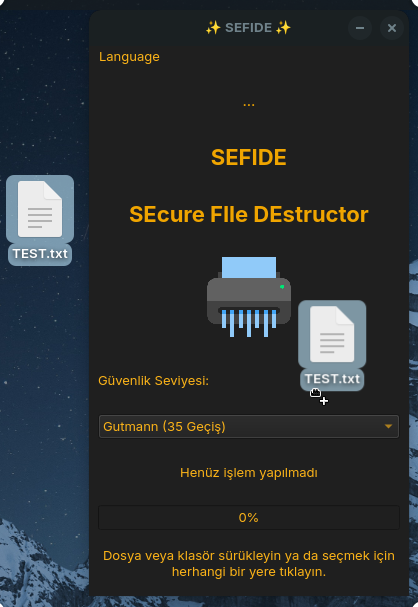

# SEFIDE
SEFIDE is a powerful tool designed to securely and permanently destroy your files. Today, sensitive information and files in the wrong hands can lead to serious security issues. This application has been developed to ensure your digital security

<h1 align="center">SEFIDE Logo</h1>

<p align="center">
  
</p>


----------------------

# Linux Screenshot
  

# Windows Screenshot
 

--------------------
Install Git Clone and Python3

Github Package Must Be Installed On Your Device.

git
```bash
sudo apt install git -y
```

Python3
```bash
sudo apt install python3 -y 

```

pip
```bash
sudo apt install python3-pip

```

# Required Libraries

PyQt5
```bash
pip install PyQt5
```
PyQt5-sip
```bash
pip install PyQt5 PyQt5-sip
```

PyQt5-tools
```bash
pip install PyQt5-tools
```

Required Libraries for Debian/Ubuntu
```bash
sudo apt-get install python3-pyqt5
sudo apt-get install qttools5-dev-tools
```
----------------------------------


# Installation
Install EnCo

```bash
sudo git clone https://github.com/cektor/SEFIDE.git
```
```bash
cd SEFIDE
```

```bash
python3 sefide.py

```

# To compile

NOTE: For Compilation Process pyinstaller must be installed. To Install If Not Installed.

pip install pyinstaller 

Linux Terminal 
```bash
pytohn3 -m pyinstaller --onefile --windowed sefide.py
```

Windows VSCode Terminal 
```bash
pyinstaller --onefile --noconsole sefide.py
```

MacOS VSCode Terminal 
```bash
pyinstaller --onefile --noconsole enco.py
```

# To install directly on Windows or Linux


Linux (based debian) Terminal: Linux (debian based distributions) To install directly from Terminal.
```bash
 wget -O EnCo_Linux64.deb https://github.com/cektor/EnCo/releases/download/1.00/Setup_Linux64.deb && sudo apt install ./EnCo_Linux64.deb && sudo apt-get install -f
```

Windows Installer CMD (PowerShell): To Install from Windows CMD with Direct Connection.
```bash
powershell -Command "Invoke-WebRequest -Uri 'https://github.com/cektor/EnCo/releases/download/1.00/Setup_Win64.exe' -OutFile 'Setup_Win64.exe'" && start /wait Setup_Win64.exe
```

Release Page: https://github.com/cektor/EnCo/releases/tag/1.00

----------------------------------
